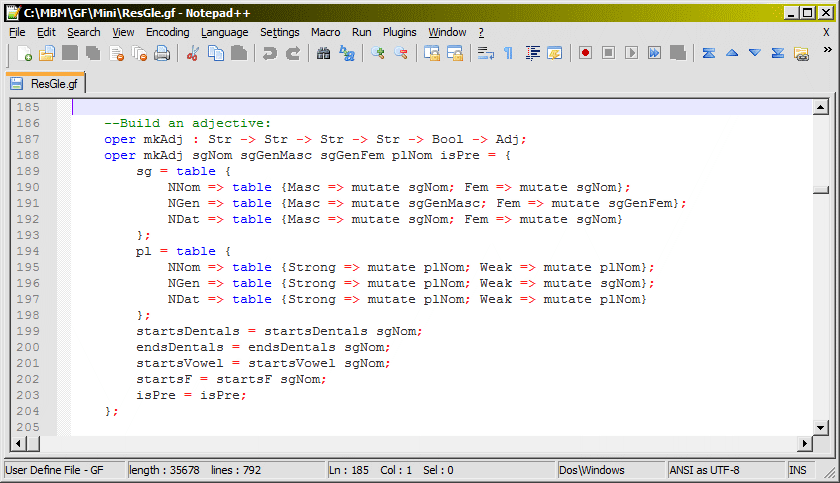

# Grammatical Framework syntax highlighter for Notepad++

This simple configuration file brings [Grammatical Framework](http://www.grammaticalframework.org/) syntax highlighting into Notepad++, a popular text editor for Windows. You can import it from the **View » User-Defined Dialogue** menu.

Tip: Notepad++'s syntax highlighter sometimes fails to recognize keywords and operators if they're not surrounded by whitespace. If ever it seems like something is not being highlighted when it should, put whitespace around it. 
